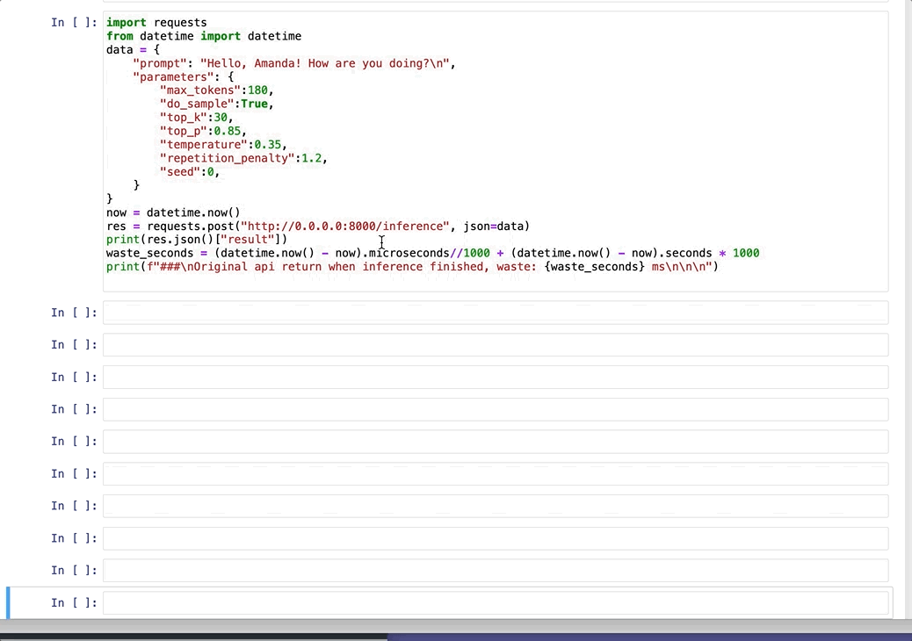
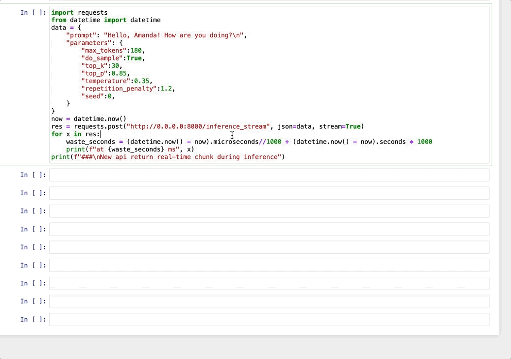

# transformers-stream-generator

### Description
This is a text generation method which returns a generator, streaming out each token in real-time during inference, based on Huggingface/Transformers. 

### Web Demo
+ original

+ stream


### Installation
```bash
pip install transformers-stream-generator
```

### Usage
1. just add two lines of code before your original code
```python
from transformers_stream_generator import init_stream_support
init_stream_support()
```

2. add `do_stream=True` in `model.generate` function and keep `do_sample=True`, then you can get a generator
```python
generator = model.generate(input_ids, do_stream=True, do_sample=True)
for token in generator:
    word = tokenizer.decode(token)
    print(word)
```

### Example
+ run python script [example](./example/run.py) by gpt2
+ run web [example](./example/run_web.py)  by gpt2 and test in client [example](./example/test_client.py)